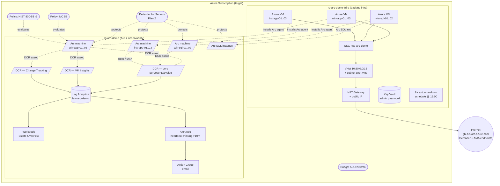

# Architecture

> What the deploy creates and how it's wired together.

## Topology

## Two resource groups, why

- **`rg-arc-demo`** — the things you'd have in a real customer environment (Arc machines, LAW, DCRs, workbook, alerts).
- **`rg-arc-demo-infra`** — the backing Azure VMs we use to *simulate* on-prem hosts. In a real engagement, these wouldn't exist — the Arc agent would be installed on actual on-prem servers.

Keeping them separate makes the demo flow read correctly in the portal (the customer never sees the "infra" RG; you only show them `rg-arc-demo`).

## Data flow

1. **Azure VMs** boot and the deploy script installs the **Connected Machine Agent** (`azcmagent`) with `MSFT_ARC_TEST=true` (officially supported for demo scenarios) so it registers a **Microsoft.HybridCompute/machines** resource in `rg-arc-demo`.
2. The deploy script then installs three extensions on each Arc machine:
   - **AzureMonitorAgent** (or **AzureMonitorWindowsAgent**) — collects perf, events, syslog.
   - **DependencyAgentWindows** (Windows only — Ubuntu kernel unsupported) — feeds the VM Insights Map.
   - **ChangeTracking-Windows** / **ChangeTracking-Linux** — tracks file/software/registry/service changes.
3. Each Arc machine has **three DCR associations** (core / VM Insights / Change Tracking). The DCRs route to the same workspace.
4. **Defender for Servers Plan 2** is enabled at subscription scope; it auto-deploys the MDE extension and (for SQL hosts) the Defender for SQL extension.
5. **MCSB + NIST 800-53 r5** policy initiatives are assigned at subscription scope — their results power the regulatory compliance scorecard in Defender for Cloud (~12h to first populate).
6. The **Estate Overview workbook** pulls all of the above into one persona-ordered dashboard.

## Networking

- VMs sit in a single `/24` subnet behind an empty NSG (no inbound rules).
- A **NAT Gateway** provides outbound internet for the Arc agent's outbound-only API calls (required — Azure default outbound is being deprecated).
- The NAT GW is deleted by `Hibernate-ArcDemo.ps1` to save ~AUD 55/mo and recreated by `Activate-ArcDemo.ps1`.

## Identity

- VMs use system-assigned managed identities (for AMA on Linux, and SQL Arc extension).
- A service principal **`sp-arc-demo-onboard`** with the *Azure Connected Machine Onboarding* role on `rg-arc-demo` is created once and reused — its only job is for the Arc agent to register on first install.
- Key Vault stores the local-admin password (single secret `vm-admin-password`).

## Cost notes

See [`cost.md`](cost.md) for the breakdown by state (active / hibernated / removed).
